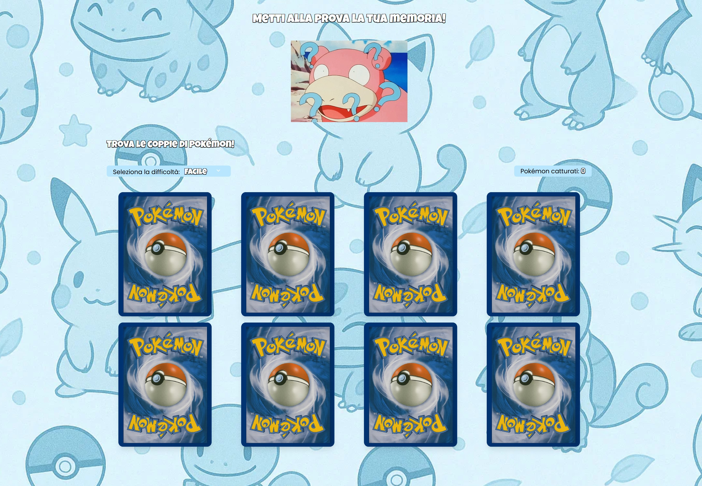
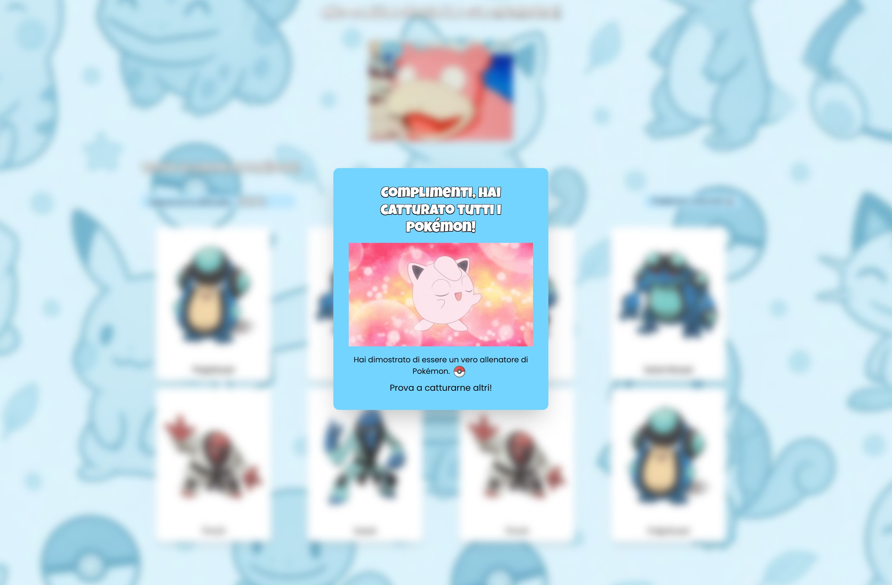

## Pokémon Memory 

Il classico gioco che mette alla prova la memoria di ognuno di noi, utilizzando le card dei Pokémon per rendere il gioco più accattivante e divertente!

La struttura del layout è semplice e intuitiva, per permettere all’utente di iniziare subito a giocare scoprendo le carte. L’utente può scegliere tra tre livelli di difficoltà:

- Facile – poche coppie di Pokémon;

- Medio – numero medio di coppie;

- Difficile – molte coppie da trovare;

Accanto alla selezione della difficoltà c’è un contatore che tiene traccia dei Pokémon catturati. Una volta che tutte le coppie sono state trovate, appare una modale di vittoria che invita l’utente a riprovare per giocare nuovamente!


### Funzionalità principali:

- Caricamento casuale di Pokémon dalla PokéAPI;
- Effetto flip 3D delle cards;
- Modale di vittoria con overlay;
- Interfaccia responsive e semplice da usare;
- Selezione della difficoltà e contatore dei Pokémon catturati.

### Tecnologie utilizzate

- React + Typescript;
- Tailwind CSS;
- PokéAPI;
- useState e useEffect per gestire la logica del gioco.

--- 

## Screenshots

### Schermata Home difficoltà: semplice



### Modale della vittoria




#### Come utilizzare il progetto

1. Clona il repository con questo comando:
```
git clone https://github.com/tuo-username/gioco-memory.git
```

2. Entra nella cartella del progetto e installa le dipendenze:
```
cd gioco-memory

npm install
```

3. Avvia il progetto con questo comando:
```
npm run dev
```
4. Il progetto sarà disponibile sul browser su questo endpoint:
```
http://localhost:5173
```
